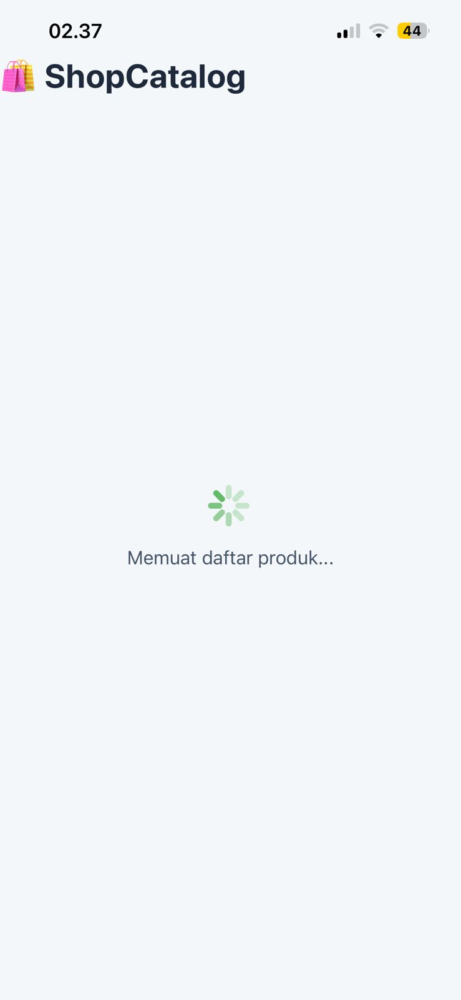
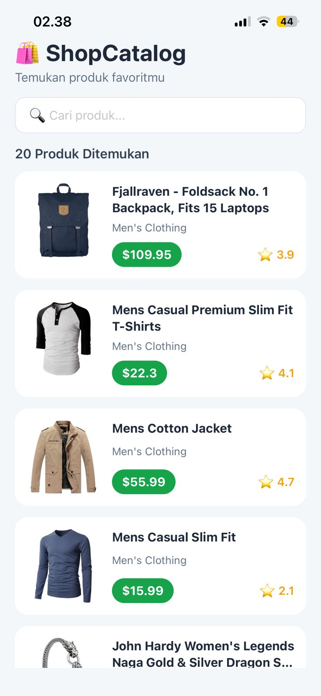
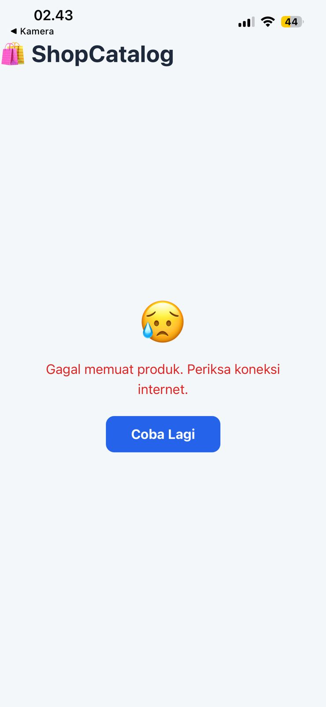

# 🛍️ ShopCatalog API App

## 📖 Deskripsi Aplikasi

ShopCatalog API App adalah aplikasi mobile berbasis React Native menggunakan Expo yang mengonsumsi REST API dari FakeStore API. Aplikasi ini menampilkan daftar produk dalam bentuk FlatList serta dilengkapi dengan fitur pencarian produk, pull-to-refresh, dan penanganan kondisi loading, success, dan error. Aplikasi ini dibuat sebagai tugas Misi 11: Build Your Own API App.

---

## 🌐 API yang Digunakan

**FakeStore API**

Endpoint:

https://fakestoreapi.com/products

---

## ✨ Fitur Aplikasi

### ✅ Level 1 (Core)

- Fetch data dari REST API menggunakan Axios
- Async/Await
- useEffect dengan dependency array (`[]`)
- Loading State (ActivityIndicator)
- Error State
- Retry Button
- Success State
- FlatList
- Menampilkan gambar produk
- Menampilkan nama produk
- Menampilkan harga produk
- Menampilkan rating produk

### ✅ Level 2

- Pull-to-Refresh
- Search Produk
- Empty State

---

## 📱 Screenshot

### 1. Loading



---

### 2. Success



---

### 3. Error



---

## 🛠️ Tech Stack

- React Native
- Expo
- JavaScript (ES6)
- Axios
- FakeStore API

---

## ▶️ Cara Menjalankan Project

### 1. Clone Repository

```bash
git clone https://github.com/misyesinaga1-alt/shop-catalog.git
```

### 2. Masuk ke Folder Project

```bash
cd shop-catalog
```

### 3. Install Dependencies

```bash
npm install
```

### 4. Jalankan Aplikasi

```bash
npx expo start
```

### 5. Jalankan di HP

- Install aplikasi **Expo Go**
- Scan QR Code yang muncul pada terminal atau browser
- Aplikasi akan berjalan di perangkat Android

---

## 📂 Struktur Project

```
shop-catalog
│
├── App.js
├── package.json
├── package-lock.json
├── babel.config.js
├── app.json
├── assets/
├── 1.jpeg
├── 2.jpeg
├── tigga.jpeg
└── README.md
```

---

## 🔗 GitHub Repository

https://github.com/misyesinaga1-alt/shop-catalog

---

## 🔗 Expo Snack

Tambahkan link Expo Snack setelah project berhasil diunggah.

Contoh:

https://snack.expo.dev/

---

## 👩‍💻 Author

**Misye Retno Wulansari Br. Sinaga**

Misi 11 – Build Your Own API App

React Native • Expo • REST API
